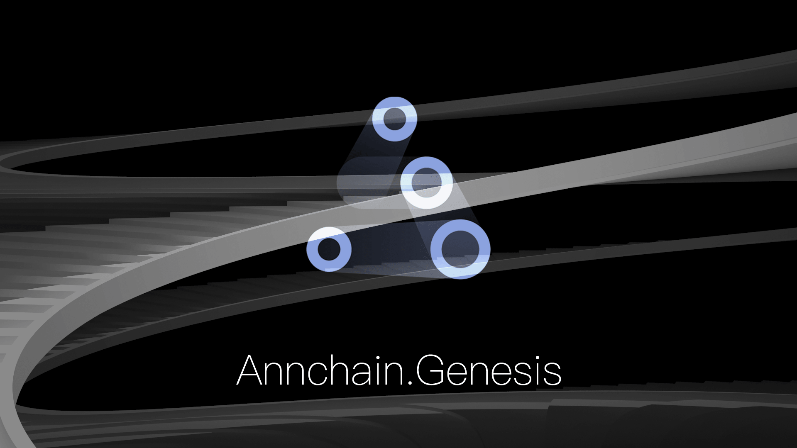

# AnnChain



<br/>

AnnChain is the core engine of the new generation alliance chain of Zhongan Science and Technology. It has the characteristics of high security, high performance and high availability. It aims to provide a tightly integrated block chain system for enterprises. It is very suitable for business cooperation among commercial organizations with alliance nature, and also for high-frequency financial transactions and security. A demanding scene. Dozens of actual business scenarios have been applied.

[](https://github.com/dappledger/AnnChain/releases/latest)
[](https://godoc.org/github.com/dappledger/AnnChain)
[](https://github.com/moovweb/gvm)
[](https://goreportcard.com/report/github.com/dappledger/AnnChain)
[](https://travis-ci.org/dappledger/AnnChain)
[](https://github.com/dappledger/AnnChain/blob/master/LICENSE)

| Branch | Tests                                                                                                                                                | Coverage                                                                                                                             |
| ------ | ---------------------------------------------------------------------------------------------------------------------------------------------------- | ------------------------------------------------------------------------------------------------------------------------------------ |
| master | [](https://travis-ci.org/dappledger/AnnChain)  | [](https://codecov.io/gh/dappledger/AnnChain) |


## Releases

Automated builds are available for stable [releases](https://github.com/dappledger/AnnChain/releases).


## Requirements

| Requirement | Notes              |
| ----------- | ------------------ |
| Go version  | Go1.12.0 or higher |


## Building the source 

``` shell
export GOPATH=$HOME/.gopkgs

git clone https://github.com/dappledger/AnnChain.git

cd AnnChain

./get_pkgs.sh

make
```

## Supported Consensus

AnnChain supports bft and raft consensus as valid consensus options,and bft is the default.if you want to use raft, you can operate like this:

##### First, set consensus to raft in config.toml file:

``` shell
consensus = "raft"
```

##### Then, add raft peers config file raft-cluster.json into the runtime dir(take four nodes for example):

``` shell
{
    "advertise": "ann7939-validator8fc99df2-2.default.svc.cluster.local:23000",
    "local": {
        "bind": "0.0.0.0:23000",
        "pub_key": [
            1,
            "35EC28D113DB8D057140F903BAB049770CABAD4C2838509602552511C3F2D2E3"
        ],
        "rpc": "ann7939-validator8fc99df2-2.default.svc.cluster.local:47000"
    },
    "peers": [
        {
            "bind": "ann7939-validator480649ca-0.default.svc.cluster.local:23000",
            "pub_key": [
                1,
                "7B788FD0A5A1504C438B2D6B5602717C07F5E82D25175B4065B75C46017B770D"
            ],
            "rpc": "ann7939-validator480649ca-0.default.svc.cluster.local:47000"
        },
        {
            "bind": "ann7939-validatorb14a47dc-1.default.svc.cluster.local:23000",
            "pub_key": [
                1,
                "1FE0A5560BB9376348CB8F218BDA2011280606571DB20B841FA9F7560143796D"
            ],
            "rpc": "ann7939-validatorb14a47dc-1.default.svc.cluster.local:47000"
        },
        {
            "bind": "ann7939-validator8fc99df2-2.default.svc.cluster.local:23000",
            "pub_key": [
                1,
                "35EC28D113DB8D057140F903BAB049770CABAD4C2838509602552511C3F2D2E3"
            ],
            "rpc": "ann7939-validator8fc99df2-2.default.svc.cluster.local:47000"
        },
        {
            "bind": "ann7939-validatore78bd527-3.default.svc.cluster.local:23000",
            "pub_key": [
                1,
                "3C521E9D3D942654FA1E6C52E7B3A4EDE059E047FB4DF4F00F04C092149002EA"
            ],
            "rpc": "10.103.237.176:47000"
        }
    ]
}
```

* advertise: advertise address is used for others peers to connect.

* local.bind: local bind address for raft protocl.

* local.pub_key: node's pubkey, same as pbft pubkey.

* local.rpc: node's rpc bind address.

* peers: others node's bind address and pub_key info, including it selft.


## Quick Start

#### Single node

``` shell
./build/genesis init

./build/genesis run
```

#### Local cluster using docker-compose

``` shell
## start cluster
➜  docker-compose up

## remove cluster
➜  docker-compose down
```

## Usage

[Command Tool](https://github.com/dappledger/AnnChain/tree/master/docs/cmd.md)
<br/>
[Golang SDK](https://github.com/dappledger/AnnChain-go-sdk)
<br/>
[Java SDK](https://github.com/dappledger/ann-java-sdk)


## Applications

- [Explorer](https://github.com/dappledger/ann-explorer)


## Contributing

If you have any questions,please [report](https://github.com/dappledger/AnnChain/issues).
<br/>
If you'd like to contribute code, please fork, fix, commit and send a [pull request](https://github.com/dappledger/AnnChain/pulls) for the maintainers to review and merge into the main code base


