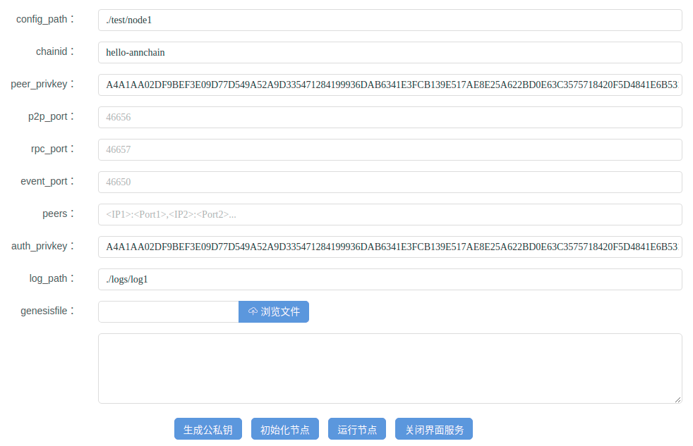

# AnnChain
- [AnnChain](#AnnChain)
    - [简介](#简介)
    - [安装配置](#安装配置)
    - [源码方式](#源码方式)
        - [编译环境](#编译环境)
        - [build](#build)
    - [直接获取可执行文件](#直接获取可执行文件)
    - [初始化和运行](#初始化和运行)
    - [创建子应用](#创建子应用)
        - [evm子应用](#evm子应用)
        - [ikhofi(jvm)子应用](#ikhofi(jvm)子应用)

## 简介
安链(AnnChain)主要的目标是要能够以区块链技术为基础,承载众安科技的众多产品,快速开发部署联盟链。安链采用三层架构:协议层、扩展层和应用层,分别用以存储不可篡改的原始数据、实现各种功能(例如,智能合约)和运行各种应用(例如,银行的移动应用)。每个区块链节点可以部署多个子链,子链承载不同应用。目前,我们支持的应用有以太坊合约引擎和JVM合约引擎。

安链的开源协议为GPL3.0，详情参⻅[LICENSES](https://github.com/dappledger/AnnChain/blob/master/LICENSE)。
## 安装配置
OS : Linux/Mac OS
## 源码方式
### 编译环境
- git
- go1.9及以上
- jdk1.8及以上(ikhofi)
### build
```shell
$git clone https://github.com/dappledger/AnnChain.git $GOPATH/src/github.com/dappledger/AnnChain
$cd $GOPATH/src/github.com/dappledger/AnnChain
$make
```
编译后的文件(`ann`,`anntool`)在项目的`build`目录下。
## 直接获取可执行文件
[所有发布的可执行包](https://github.com/dappledger/AnnChain/releases)

Linux : [ann](https://github.com/dappledger/AnnChain/releases/download/v1.0.1/ann1.0.1.linux-amd64.tar.gz), [anntool](https://github.com/dappledger/AnnChain/releases/download/v1.0.1/anntool1.0.1.linux-amd64.tar.gz)

Mac : [ann](https://github.com/dappledger/AnnChain/releases/download/v1.0.1/ann1.0.1.darwin-amd64.zip), [anntool](https://github.com/dappledger/AnnChain/releases/download/v1.0.1/anntool1.0.1.darwin-amd64.zip)
## 初始化和运行
- 命令行方式
```shell
$./build/ann init --runtime="./test/node1" --chain_id="hello-annchain"
Using config file: test/node1/config.toml
Initialized chain_id: hello-annchain genesis_file: test/node1/genesis.json priv_validator: test/node1/priv_validator.json
Check the files generated, make sure everything is OK.
```
- 图形方式
```shell
$./build/ann init --visual="true" --vport=":8888"
2018/05/04 18:12:32.085 [I] http server Running on http://:8888
```
参数`visual`指定以可视化形式初始化节点配置,默认false。`vport`指定界面端口,默认8080。

浏览器打开`http://127.0.0.1:8888`:

`config_path`是配置和数据文件生成的目录。`chainid`链名字。`peer_privkey`是节点私钥,可以通过下方`生成公私钥`按钮随机生成。`p2p_port`是节点的p2p监听端口,默认46656。`rpc_port`是节点对外提供rpc/restful服务的监听端口,默认46657。`event_port`是节点间处理事件类型交易签名的端口,默认46650。`peers`是配置多节点环境时,用以告知其余参与p2p连接的节点监听地址。`auth_privkey`是要加入链p2p网络中CA认证节点的私钥。`log_path`是日志目录。`genesispath`是初始网络的节点信息配置,单节点可不填。模板为:
```json
{
	"genesis_time": "0001-01-01T00:00:00Z",
		"chain_id": "hello-annchain",
		"validators": [
		{
			"pub_key": [
				1,
			"7AE8E25A622BD0E63C3575718420F5D4841E6B531B6BF23CAE0B686BD47D2B08"
			],
			"amount": 100,
			"name": "",
			"is_ca": true
		}
		],
		"app_hash": "",
		"plugins": "specialop,querycache"
}
```
配置信息填写完毕后,点击`初始化节点`,对话框返回`Done!`后即说明完成数据初始化。再点击`运行节点`,对话框返回`node is runing....`则启动成功。之后在命令行通过`tailf ./logs/log1/angine-hello-annchain/output.log`可以从日志中看到块的高度增⻓。如果需要以可视化方式起多个节点,可以点击`停止界面服务`释放本次服务的端口,再以visual方式运行初始化命令。

- 多节点配置

__方案一__:运行区块链前已经获知链中各个节点的信息(链id、p2p端口、节点私钥、是否为validator),可以修改config.xml中的p2p地址、genesis.json的chain_id以及validator列表等初始化文件,然后运行各个节点组成一条链。

__方案二__:运行后加入新节点,将已有节点的p2p地址加入新节点config.xml的p2p_laddr字段中,修改genesis.json的chainid和要加入区块链的chainid一致,启动节点,可以看到新节点从原先的链中同步块。此时新节点只同步块,不会参与出块。如果需要提升为参与共识的出块节点,可以通过anntool的specailop命令操作。

- 详细说明参考[操作文档](./docs/ann-chain-op.md)。
## 创建子应用
以上述步骤创建单节点运行并运行后为例。节点私钥:`A4A1AA02DF9BEF3E09D77D549A52A9D335471284199936DAB6341E3FCB139E517AE8E25A622BD0E63C3575718420F5D4841E6B531B6BF23CAE0B686BD47D2B08`,公钥:`7AE8E25A622BD0E63C3575718420F5D4841E6B531B6BF23CAE0B686BD47D2B08`。

- 创建操作合约的账户,evm和ikhofi通用:
```shell
$./build/anntool account generate
privkey:  b00d886c8b115e08065ba130c52ed9953783c74ffe4a681e731aeaaf04142e0e
pubkey: 0473c86c0c594d70dcdb1517a1333e6312afb21d5dcb504e4f80e03fca3b9513dfd8415c58e5e366de43528b6b8b8558f7e334fed43141f38d34930850eced7dd9
address: 2a55964ff12f02bf00db5b513948d224d09716c1
```
### evm子应用
该类型应用的功能是为用户提供创建、执行、读取以太坊solidity合约的服务。示例文件在`./scripts/examples/evm/`。

- 向主链添加子链,链id为`annchain-evm`:
```shell
$cat tmp/genesis.json
{
	"genesis_time": "0001-01-01T00:00:00Z",
		"chain_id": "annchain-evm",
		"validators": [
		{
			"pub_key": [
				1,
			"7AE8E25A622BD0E63C3575718420F5D4841E6B531B6BF23CAE0B686BD47D2B08"
			],
			"amount": 100,
			"name": "",
			"is_ca": true
		}
		],
		"app_hash": "",
		"plugins": "specialop,querycache"
}
$cat tmp/config.toml
auth_by_ca = false
appname = "evm"				// 指定子链负载的app类型，可选项有evm/ikhofi
db_backend = "leveldb"
environment = "development"
fast_sync = "true"
log_path = "./logs/log1"
moniker = "anonymous"
non_validator_auth_by_ca = false
p2p_laddr = "tcp://0.0.0.0:46666"	// 节点p2p连接对外的监听地址，不可重用
event_laddr = "tcp://0.0.0.0:46660"	// 节点事件交易的服务监听地址，不可重用
cosi_laddr = "tcp://0.0.0.0:46661"	// 节点事件交易多签的监听地址，不可重用
seeds = ""				// 其余节点的p2p监听地址，用于发起连接
signbyca = ""				// 当auth_by_ca为true时，内容为ca节点对本节点公钥+链名的签名，用于加入网络的身份验证
skip_upnp = "true"
$./build/anntool --callmode="commit" --backend="tcp://127.0.0.1:46657" --target="hello-annchain" organization create --genesisfile ./tmp/genesis.json --conf
igfile ./tmp/config.toml --privkey A4A1AA02DF9BEF3E09D77D549A52A9D335471284199936DAB6341E3FCB139E517AE8E25A622BD0E63C3575718420F5D4841E6B531B6BF23CAE0B686BD
47D2B08
send ok:  11ccfa53230f6990922e60f538feed1ade6369de58597eb53ce173ea588312fc
```
节点运行的终端输出`organization annchain-evm is running`,成功加入evm子应用。

- 创建合约
```shell
$./build/anntool --backend "tcp://127.0.0.1:46657" --target="annchain-evm" evm create --abif ./scripts/examples/evm/sample.abi --callf ./scripts/examples/evm/sample.deploy.json --nonce 0
tx result: 0x08ed78bf8a4d71d12c0a5eb427fbd4af52ac30deda37f4ec82078d1a59975321
contract address: 0x5b91b6c8a1091290f57fa7fe14e26c2e52cdd04a
```

- 执行合约
```shell
$./build/anntool --backend "tcp://127.0.0.1:46657" --target="annchain-evm" evm execute --abif ./scripts/examples/evm/sample.abi --callf ./scripts/examples/evm/sample.set.json --nonce 1
tx result: 0xe19c56bfda13cb71b5a702e85b2aabdf177304e7b3f99b7830ea8d01797c4a9a
```

- 读取合约
```shell
$./build/anntool --backend "tcp://127.0.0.1:46657" --target="annchain-evm" evm read --abif ./scripts/examples/evm/sample.abi --callf ./scripts/examples/evm/sample.get.json --nonce 2
parse result: string world
```

### ikhofi子应用
该类型应用的功能为用户创建、执行、读取java编写合约的服务。示例文件在`./scripts/examples/ikhofi/`。

- 获取运行所需jar包

[ikhofi-all-0.6.5-jar-with-dependencies.jar](https://github.com/dappledger/AnnChain/releases/download/v1.0.1/ikhofi-all-0.6.5-jar-with-dependencies.jar)

[ikhofi-server-0.6.5.jar](https://github.com/dappledger/AnnChain/releases/download/v1.0.1/ikhofi-server-0.6.5.jar)

- 准备ikhofi运行环境
```shell
$cp -rf ikhofi-all-0.6.5-jar-with-dependencies.jar $JAVA_HOME/jre/lib/ext/
$java -jar target/ikhofi-server-0.6.5.jar --server.port=46671
```

- 向主链添加子链，链id为`annchain-ikh`：
```shell
$cat tmp/genesis.json
{
       "genesis_time": "0001-01-01T00:00:00Z",
       "chain_id": "annchain-ikh",
       "validators": [
               {
                       "pub_key": [
                               1,
                               "7AE8E25A622BD0E63C3575718420F5D4841E6B531B6BF23CAE0B686BD47D2B08"
                       ],
                       "amount": 100,
                       "name": "",
                       "is_ca": true
               }
       ],
       "app_hash": "",
       "plugins": "specialop,querycache"
}
$cat tmp/config.toml
auth_by_ca = false
appname = "ikhofi"			// 指定子链负载的app类型，可选项有evm/ikhofi
db_backend = "leveldb"
environment = "development"
fast_sync = "true"
log_path = "./logs/log2"
moniker = "anonymous"
non_validator_auth_by_ca = false
p2p_laddr = "tcp://0.0.0.0:46676"	// 节点p2p连接对外的监听地址，不可重用
cosi_laddr = "tcp://0.0.0.0:46670"	// 节点事件交易多签的监听地址，不可重用
ikhofi_addr = "http://0.0.0.0:46671"	// ikhofi-server启动时指定的监听地址
seeds = ""				// 其余节点的p2p监听地址，用于发起连接
signbyca = ""				// 当auth_by_ca为true时，内容为ca节点对本节点公钥+链名的签名，用于加入网络的身份验证
skip_upnp = "true"
$./build/anntool --callmode="commit" --backend="tcp://127.0.0.1:46657" --target="hello-annchain" organization create --genesisfile ./tmp/genesis.json --configfile ./tmp/config.toml --privkey A4A1AA02DF9BEF3E09D77D549A52A9D335471284199936DAB6341E3FCB139E517AE8E25A622BD0E63C3575718420F5D4841E6B531B6BF23CAE0B686BD47D2B08
```

节点运行的终端输出`organization annchain-ikh is running`,成功加入ikhofi子应用。

- 创建合约
```shell
$./build/anntool --target="annchain-ikh" --backend="tcp://127.0.0.1:46657" ikhofi execute -contractid system -method "deploy('SampleContract', './scripts/examples/ikhofi/SampleContract.class')" --privkey b00d886c8b115e08065ba130c52ed9953783c74ffe4a681e731aeaaf04142e0e                                                             
send ok:  70130bc011b4d3a19214b0afe86355e97cf2a829d60d6fc28f9a9c07deb3a20e
```

- 执行合约
```shell
$./build/anntool --target="annchain-ikh" --backend="tcp://127.0.0.1:46657" ikhofi execute -contractid SampleContract -method "set('hello', 'world')" -privkey b00d886c8b115e08065ba130c52ed9953783c74ffe4a681e731aeaaf04142e0e
txHash:022c3ae922d3ecf2a05658bd933707f16135490f7f79b82408074d639b203076
```

- 读取合约
```shell
$./build/anntool --target="annchain-ikh" --backend="tcp://127.0.0.1:46657" ikhofi query -contractid SampleContract -method "get('hello')" -privkey b00d886c8b115e08065ba130c52ed9953783c74ffe4a681e731aeaaf04142e0e
query result code: 0
query result value: world
query result message:
```

