#### Table of contents
(toc generated by [ghtoc](https://github.com/sk1418/ghtoc))
- [安装配置](#安装配置)
    - [1 主链部署](#1-主链部署)
    - [2 EVM合约子链部署](#2-EVM合约子链部署)
    - [3 JVM合约子链(ikhofi)部署](#3-JVM合约子链(ikhofi)部署)
- [智能合约](#智能合约)
    - [1 solidity智能合约](#1-solidity智能合约)
        - [1.1 使用方法](#1.1-使用方法)
        - [1.2 简单的合约示例](#1.2-简单的合约示例)
    - [2 JVM(ikhofi)智能合约](#2-JVM(ikhofi)智能合约)
        - [2.1 编译命令](#2.1-编译命令)
        - [2.2 编写规则](#2.2-编写规则)
        - [2.3 简单合约示例](#2.3-简单合约示例)
- [工具使用](#工具使用)
    - [1 命令行工具](#1-命令行工具)
    - [2 UI工具(vanntool)](#2-UI工具(vanntool))
        - [2.1 部署](#2.1-部署)
        - [2.2 准备工作](#2.2-准备工作)
        - [2.3 validator 属性变更](#2.3-validator-属性变更)
        - [2.4 子链管理](#2.4-子链管理)
            - [2.4.1 创建子链（组织）](#2.4.1-创建子链（组织）)
            - [2.4.2 加入子链（组织）](#2.4.2-加入子链（组织）)
            - [2.4.3 退出子链（组织）](#2.4.3-退出子链（组织）)
        - [2.5 链间事件管理](#2.5-链间事件管理)
            - [2.5.1 上传 code](#2.5.1-上传-code)
            - [2.5.2 通讯请求](#2.5.2-通讯请求)
            - [2.5.3 取消](#2.5.3-取消)
        - [2.6 evm 合约操作](#2.6-evm-合约操作)
            - [2.6.1 创建evm合约](#2.6.1-创建evm合约)
            - [2.6.2 执行](#2.6.2-执行)
            - [2.6.3 读取](#2.6.3-读取)
        - [2.7 ikhofi（jvm）合约操作](#2.7-ikhofi（jvm）合约操作)
            - [2.7.1 创建 jvm 合约](#2.7.1-创建-jvm-合约)
            - [2.7.2 执行](#2.7.2-执行)
            - [2.7.3 读取](#2.7.3-读取)
    - [3 API服务](#3-API服务)
        - [3.1 部署](#3.1-部署)
        - [3.2 api文档](#3.2-api文档)
    - [4 区块链浏览器](#4-区块链浏览器)
        - [4.1 部署](#4.1-部署)
        - [4.2 当前链的高度和交易数量](#4.2-当前链的高度和交易数量)
        - [4.3 详细数据](#4.3-详细数据)
            - [4.3.1 块数据](#4.3.1-块数据)
            - [4.3.2 交易数据](#4.3.2-交易数据)
- [FAQ](#FAQ)
# 安装配置
## 1 主链部署
安链是联盟链，在组建链网络时，需要事先配置参与共识的Validator节点信息。节点编译后的二进制包名为`ann`，节点操作工具的二进制包名为`anntool`。

* __1.__ 初始化节点
```shell
	ann init
```
初始化将会在 $ANGINE_RUNTIME/.angine 目录下产生3个配置文件，分别是：
```shell
	config.toml           // 链运行所需要的参数
	genesis.json          // 创世块信息
	priv_validator.json   // 节点身份信息
```
* __2.__ 区块链 ID
genesis.json 配置文件中 chain\_id 参数表示当前链的 ID，需要加入同一个链网络的节点，需保持 chain\_id 一致。
* __3.__ 初始验证节点
genesis.json 文件中有一个 validators 数组，表示链的初始状态下，有哪些验证节点。假设我们初始有4个验证节点，则需要将这4个节点的信息填写进validators数组。像下边这样：
```json
	"validators": [
		{
			"pub_key": [
				1,
				"BEED23BC7F3427809FACB27A2A15AA4929FE30AE44C4523A70A261299F52AAE9"
			],
			"amount": 100,
			"is_ca": true
		},
		{
			"pub_key": [
				1,
				"4485349A302B4F08B08D0602B6E205B587127DECF1C326C0D1038612E8966E1A"
			],
			"amount": 100,
			"is_ca": true
		},
		...
	],
```
* __4.__ 配置连接 p2p节点
在 config.toml 配置文件中：
```shell 
	p2p_laddr = "tcp://0.0.0.0:46656"  # p2p_laddr参数表示本节点对外的监听端口
	seeds = "192.168.24.105:46656" # seeds 参数表示节点接入链网络的入口，可以填多个，英文逗号分割
```
* __5.__ 启动 
 配置好之后，各个节点执行启动命令
```shell
	ann run
```
也可以使其在后台启动
```shell
	nohup ann run &
```
启动之后，可以在 $PWD/angine-XXX（XXX是上边提到的 chain\_id）目录中看到链执行的日志，查看该日志可以看到链运行输出的信息。

* 配置字段说明

a) config.toml 配置项
```toml
	auth_by_ca = false                        // 加入链网络时是否使用CA认证
	non_validator_auth_by_ca = true           // auth_by_ca=true 时有效，表示非验证节点加入链网络时是否使用CA认证
	db_backend = "leveldb"                    // 底层数据库，暂不可改
	environment = "development"               // 日志级别，支持development和production
	fast_sync = "true"                        // 是否启用快速同步
	log_path = ""                             // 日志路径
	moniker = "anonymous"                     // 暂不支持修改
	p2p_laddr = "tcp://0.0.0.0:46656"         // P2P 监听端口
	rpc_laddr = "tcp://0.0.0.0:46657"         // 本地RPC命令监听端口
	event_laddr = "tcp://0.0.0.0:46658"       // 链间事件监听端口
	seeds = "192.168.24.105:46656"             // 加入链网络的入口地址
	signbyca = ""                             // auth_by_ca=true 时有效，CA节点给当前节点公钥追加chainid的签名
	skip_upnp = "true"                        // 是否跳过skip_upnp地址映射机制
```
b) genesis.json 配置项
```json
	{
		"genesis_time": "0001-01-01T00:00:00Z",       // 创世
		"chain_id": "annchain-k2fc41",                // 链 ID
		"validators": [                               // validators 数组
			{
				"pub_key": [                          // 公钥
					1,
					"5BE3622901BA3A93F81119C262EAB3B8321180FBD9CE49B00D05A1335F8BD14F"
				],
				"amount": 100,                        // 权重
				"is_ca": true                         // 是否是CA节点，auth_by_ca=true 时有效
			}
		],
		"app_hash": "",                               // 自定义起始的state状态
		"plugins": "specialop,querycache"             // 插件
	}
```

c) priv_validator.json 配置项
```json
	{
		"pub_key": [                                  // 节点公钥
			1,                                        // 公钥加密算法，代表ED25519，暂不支持修改
			"5BE3622901BA3A93F81119C262EAB3B8321180FBD9CE49B00D05A1335F8BD14F"
		],
		"last_height": 0,                             // 共识状态，无需修改
		"last_round": 0,                              // 共识状态，无需修改
		"last_step": 0,                               // 共识状态，无需修改
		"last_signature": null,                       // 共识状态，无需修改
		"last_signbytes": "",                         // 共识状态，无需修改
		"priv_key": [                                 // 节点私钥
			1,
			"8A0F79C3434808CADF184000649E368C0C0A53206BC84066A6437BDE39E493595BE3622901BA3A93F81119C262EAB3B8321180FBD9CE49B00D05A1335F8BD14F"
		]
	}
```
## 2 EVM合约子链部署
前提：主链`annchain-civil`已存在
```shell
	anntool --callmode="commit" --backend="tcp://127.0.0.1:46657" --target="annchain-civil" organization create --genesisfile /ann/jvm/genesis.json --configfile /ann/jvm/config.toml --privkey 187AE5C4590FE082938AD88B72F9487179E008A98FBACEB57C177BDD92F5FE9586161EBF8C395F6CA85B74B09C8F60CCE7D82E81B0744DCC6193FA8F810CC422
```
## 3 JVM合约子链(ikhofi)部署
前提：主链`annchain-civil`已存在

* __1.__ 配置环境
安装或解压jdk到指定目录，然后设置环境变量，需要java1.8及以上。

__linux:__
```shell
    # for java
    export JAVA_HOME=/usr/lib/jvm/jdk1.8.0_101
    export JRE_HOME=${JAVA_HOME}/jre
    export CLASSPATH=.:${JAVA_HOME}/lib:${JRE_HOME}/lib
    export PATH=${JAVA_HOME}/bin:${JRE_HOME}/bin:$PATH
    
    # for ikhofi
    export CGO_CFLAGS="-I$JAVA_HOME/include -I$JAVA_HOME/include/linux"
    export CGO_LDFLAGS="-L$JAVA_HOME/jre/lib/amd64/server/ -ljvm -Wl,-rpath,$JAVA_HOME/jre/lib/amd64/server/"
    export IKHOFI_PATH="$HOME/ikhofi/_release/ikhofi.jar"
```
__mac:__
```shell
	# for java(略)
	
	# for ikhofi
	export CGO_CFLAGS="-I$JAVA_HOME/include -I$JAVA_HOME/include/darwin"
	export CGO_LDFLAGS="-L$JAVA_HOME/jre/lib/server/ -ljvm -Wl,-rpath,$JAVA_HOME/jre/lib/server/"
	export IKHOFI_PATH="$HOME/ikhofi/_release/ikhofi.jar"
```
需要设置config.toml和genesis.json文件，其中config.toml是子链相关配置，genesis.json是子链的启动设置（包括validator等）。

config.toml文件(参考主链的config.toml配置)
```toml
    # This is a TOML config file.
    # For more information, see https://github.com/toml-lang/toml
    
    seeds = ""
    appname = "ikhofi"
    p2p_laddr = "0.0.0.0:50011"
    log_path = "./logs"
    auth_by_ca = false
    signbyCA = ""
    cosi_laddr = "0.0.0.0:55011"
    ikhofi_addr = "http://127.0.0.1:56001"
```
其中，seeds配置参考主链，appname固定为"ikhofi"，ikhofi_addr为ikhofi-server的地址。

genesis.json文件(参考主链的genesis.json配置)
```json
    {
            "app_hash": "",
            "chain_id": "jvm",
            "genesis_time": "0001-01-01T00:00:00.000Z",
            "plugins": "specialop",
            "validators": [
                    {
                            "amount": 100,
                            "is_ca": true,
                            "name": "",
                            "pub_key": [
                                    1,
                                    "5A6069C499CE73F4B92192BF6246ECD9C9E78179A73A6187AD4AA8E676B38B7A"
                            ]
                    }
            ]
    }
```

* __2.__ 部署ikhofi的沙箱jar包
```shell
	cp -rf ikhofi.jar $JAVA_HOME/jre/lib/ext/
```
* __3.__ 启动ikhofi-server进程
* __4.__ ikhofi子链加入主链(annchain-civil)
```shell
	anntool --callmode="commit" --backend="tcp://127.0.0.1:46657" --target="annchain-civil" organization create --genesisfile /ann/jvm/genesis.json --configfile /ann/jvm/config.toml --privkey 187AE5C4590FE082938AD88B72F9487179E008A98FBACEB57C177BDD92F5FE9586161EBF8C395F6CA85B74B09C8F60CCE7D82E81B0744DCC6193FA8F810CC422
```

# 智能合约
目前智能合约还没有标准的官方定义，大家的理解也不尽相同，但是从技术实现的角度看，智能合约是由用户编写的，运行在可复制、共享的账本上的计算机程序，可以自动处理信息，接收、储存和发送价值。
智能合约（smart contract）这个术语至少可以追溯到1995年，是由多产的跨领域法律学者尼克·萨博（Nick Szabo）提出来的。他在发表在自己的网站的几篇文章中提到了智能合约的理念。他的定义如下：
“一个智能合约是一套以数字形式定义的承诺（promises），包括合约参与方可以在上面执行这些承诺的协议。”
由此看来，智能合约是写入计算机的可读代码，一旦合约参与方达成协议，合约代码将自动执行，不以合约参与方的意志为转移。
## 1 solidity智能合约
以太坊的智能合约引擎EVM（Ethereum Virtual Machine）是相对使用较多的一个智能合约实现，功能相对简单，采用类javascript语言开发，使用门槛低，吸引了大量的初学者。安链以子链的形式提供以太坊虚拟机执行环境。
### 1.1 使用方法

* 在线编译地址：http://remix.ethereum.org/
* 本地编译参考：http://solidity.readthedocs.io/en/latest/installing-solidity.html#building-from-source

基础本地编译命令：
```shell
	solc --bin  --abi  -o {/path/to/outputdir/}
```
### 1.2 简单的合约示例

源码：

```javascript
pragma solidity ^0.4.0;

contract Simple {
  address owner;
  uint public value;
  bool public inited;
  mapping (address => uint) public ledger;

  modifier require(bool cond) {
    if (!cond) {
      throw;
    }
    _;
  }

  function Simple(uint newval) {
    owner = msg.sender;
    inited = false;
    value = newval;
  }

  function init(uint a) {
    inited = true;
    value = a;
    ledger[owner] = a;
  }

  function transfer(address recv, uint amount) returns (uint newB) {
    if (amount > ledger[owner]) {
      throw;
    }
    ledger[owner] -= amount;
    ledger[recv] += amount;

    return ledger[recv];
  }

  function getBalance(address ad) returns (uint bal) {
    return ledger[ad];
  }
}
```

编译输出二进制：

```shell
======= simple.sol:Simple ======= 
Binary:  
6060604052341561000c57fe5b604051602080610515833981016040528080519060200190919050505b33600060006101000a81548173ffffffffffffffffffffffffffffffffffffffff021916908373ffffffffffffffffffffffffffffffffffffffff1602179055506000600260006101000a81548160ff021916908315150217905550806001819055505b505b6104778061009e6000396000f30060606040523615610076576000357c0100000000000000000000000000000000000000000000000000000000900463ffffffff1680633fa4f2451461007857806343c885ba1461009e578063a9059cbb146100c8578063b7b0422d1461011b578063f8b2cb4f1461013b578063fbfa941f14610185575bfe5b341561008057fe5b6100886101cf565b6040518082815260200191505060405180910390f35b34156100a657fe5b6100ae6101d5565b604051808215151515815260200191505060405180910390f35b34156100d057fe5b610105600480803573ffffffffffffffffffffffffffffffffffffffff169060200190919080359060200190919050506101e8565b6040518082815260200191505060405180910390f35b341561012357fe5b610139600480803590602001909190505061035d565b005b341561014357fe5b61016f600480803573ffffffffffffffffffffffffffffffffffffffff169060200190919050506103e9565b6040518082815260200191505060405180910390f35b341561018d57fe5b6101b9600480803573ffffffffffffffffffffffffffffffffffffffff16906020019091905050610433565b6040518082815260200191505060405180910390f35b60015481565b600260009054906101000a900460ff1681565b600060036000600060009054906101000a900473ffffffffffffffffffffffffffffffffffffffff1673ffffffffffffffffffffffffffffffffffffffff1673ffffffffffffffffffffffffffffffffffffffff1681526020019081526020016000205482111561025857610000565b8160036000600060009054906101000a900473ffffffffffffffffffffffffffffffffffffffff1673ffffffffffffffffffffffffffffffffffffffff1673ffffffffffffffffffffffffffffffffffffffff1681526020019081526020016000206000828254039250508190555081600360008573ffffffffffffffffffffffffffffffffffffffff1673ffffffffffffffffffffffffffffffffffffffff16815260200190815260200160002060008282540192505081905550600360008473ffffffffffffffffffffffffffffffffffffffff1673ffffffffffffffffffffffffffffffffffffffff1681526020019081526020016000205490505b92915050565b6001600260006101000a81548160ff021916908315150217905550806001819055508060036000600060009054906101000a900473ffffffffffffffffffffffffffffffffffffffff1673ffffffffffffffffffffffffffffffffffffffff1673ffffffffffffffffffffffffffffffffffffffff168152602001908152602001600020819055505b50565b6000600360008373ffffffffffffffffffffffffffffffffffffffff1673ffffffffffffffffffffffffffffffffffffffff1681526020019081526020016000205490505b919050565b600360205280600052604060002060009150905054815600a165627a7a72305820e2d6951af394cafddd62cb6ad0acc79017a212306d1318ace0f7443c89d6deab0029
```

ABI文件内容：

```json
[{"constant":true,"inputs":[],"name":"value","outputs":[{"name":"","type":"uint256"}],"payable":false,"type":"function"},{"constant":true,"inputs":[],"name":"inited","outputs":[{"name":"","type":"bool"}],"payable":false,"type":"function"},{"constant":false,"inputs":[{"name":"recv","type":"address"},{"name":"amount","type":"uint256"}],"name":"transfer","outputs":[{"name":"newB","type":"uint256"}],"payable":false,"type":"function"},{"constant":false,"inputs":[{"name":"a","type":"uint256"}],"name":"init","outputs":[],"payable":false,"type":"function"},{"constant":false,"inputs":[{"name":"ad","type":"address"}],"name":"getBalance","outputs":[{"name":"bal","type":"uint256"}],"payable":false,"type":"function"},{"constant":true,"inputs":[{"name":"","type":"address"}],"name":"ledger","outputs":[{"name":"","type":"uint256"}],"payable":false,"type":"function"},{"inputs":[{"name":"newval","type":"uint256"}],"payable":false,"type":"constructor"}]
```
## 2 JVM(ikhofi)智能合约
为了更好的智能合约用户体验，我们自主设计并实现了ikhofi智能合约引擎，特性如下：

- 智能合约的虚拟机基于JVM，可使用JVM上的各种语言开发智能合约：java、kotlin、scala等，有效保护企业IT投资；
- 基于OPCODE的类似GAS的合约执行步数限制，避免过长的交易执行时间或恶意合约的执行；
- 基于白名单、黑名单的可用系统功能列表，只允许合约执行确定性的操作，禁止一切不确定的或恶意的操作；
- 功能强大，基于java生态的强力支持，智能合约可处理各种格式业务数据，各种hash及加解密算法支持，能实现远比以太坊合约复杂的各种真实业务场景；
- 可定制性强，基于工业级别的JVM实现，可以方便的增加、定制合约引擎的附加功能：比如国密支持等；
- 合约执行速度快， JVM有高度优化的JIT编译器，合约执行速度远远快于其他实现，也有利于整体区块链应用的处理能力提升。
### 2.1 编译命令
- 编译：
```shell
	mvn compile
```
- 如果是class文件合约，直接获取编译后的class文件。
- 如果是jar文件合约，将全部的class文件打成jar包，使用命令：
```shell
	jar cvf contract.jar target/classes/*
```
### 2.2 编写规则
- __合约入口Class命名规则__：基于ikhofi的Java智能合约可以由一个或多个Class组成，但是有且只有一个入口Class，这个入口Class的命名必须要以Contract结尾；
- __合约依赖使用__：目前，ikhofi-api引入了com.alibaba.fastjson和org.bouncycastle.bcpkix-jdk15on，之后ikhofi还会在不影响ikhofi沙箱环境的情况下，引入更多帮助Java智能合约开发者进行合约开发的依赖库。暂不支持Java智能合约自己引入需要的依赖，只能使用ikhofi-api包括的依赖库；
- __合约部署限制__：ikhofi智能合约执行引擎基于白名单、黑名单实现了可用系统功能列表，只允许合约执行确定性的操作，禁止一切不确定的或恶意的操作。
ikhofi执行引擎在JVM上构建一个沙箱环境，解决确定性问题。JVM的很多东西都是动态的，例如多线程程序设计、外部输入源（如文件系统、网络、系统属性、时钟等）、随机数产生器、硬件浮点运算的差异、垃圾回收器回调等等。但是JVM有很多优势可以被借助去建立一个确定性的执行沙箱环境，例如JVM字节码工具非常成熟可以方便去进行字节码操作、类加载机制为建立确定性沙箱执行环境提供了便利。通过JVM的ClassLoader机制，我们能够指定哪些Class能够被加载到一个指定的命名空间下，这样，这个指定的命名空间就只能使用我们允许的类来进行编程。Java语言里面除了原生类型以外都是对象，而对象要有对应的Class信息，我们通过限制Class，就能够一定程度上防止程序使用非确定性的计算了。这里，我们使用包黑名单、类黑名单和包白名单、类白名单，拒绝明显的非确定性程序调用，同时，在类加载的时候对合约代码进行确定性修改，例如打开所有合约相关类的strictfp开关确保浮点数运算的一致性。
因此，在合约开发时，所有非限制性的package、class都会被禁止部署、执行。
- __合约调用限制__：ikhofi结合Java的字节码增强技术和ClassLoader机制，我们可以让加载到沙箱环境中的所有类都被监控起来，当它消耗的资源突破了阈值，这个沙箱环境就直接被销毁，这个任务对应的交易就算作执行失败，执行事务回滚。
因此，在合约开发时，尽量避免使用过多循环、递归等调用，保证消耗的计算资源不超过规定的阈值；
- __合约存储及查询__：ikhofi可以通过使用ikhofi-api提供的区块链接口，在区块链的合约存储空间中存储一定需要上链的数据，并通过合约的调用进行计算和查询。

1.__合约数据存储__
使用TxContext的put方法，可以将数据以key-value的形式存储在区块链上的合约存储空间中，如：
```java
import io.annchain.ikhofi.api.TxContext;
...
public void setData(TxContext txContext, ...) {
...
txContext.put("key".getBytes(), bytes);
...
```
TxContext.put的两个参数分别为key和value，全部是byte[]类型，因此将数据存储到合约空间时，需要将key以及value进行数据类型转换。
转换方法：
a) 数据为String类型，直接转化为byte[]，比如key常见的使用；
b) 数据为JSON类型，可以通过ikhofi-api提供的com.alibaba.fastjson，将JSON转化为byte[]；
c) 数据为常见可序列化对象，如Map、List以及自定义对象，可以将数据转化为byte[]转化，参考代码：
```java
    public static byte[] objectToByteArray(Object obj) {
        byte[] bytes = null;
        ByteArrayOutputStream byteArrayOutputStream = null;
        ObjectOutputStream objectOutputStream = null;
        try {
            byteArrayOutputStream = new ByteArrayOutputStream();
            objectOutputStream = new ObjectOutputStream(byteArrayOutputStream);
            objectOutputStream.writeObject(obj);
            objectOutputStream.flush();
            bytes = byteArrayOutputStream.toByteArray();
        } catch (IOException e) {
            e.printStackTrace();
        } finally {
            if (objectOutputStream != null) {
                try {
                    objectOutputStream.close();
                } catch (IOException e) {
                    e.printStackTrace();
                }
            }
            if (byteArrayOutputStream != null) {
                try {
                    byteArrayOutputStream.close();
                } catch (IOException e) {
                    e.printStackTrace();
                }
            }
        }
        return bytes;
    }
```
d) 其它类型也可以进行encode后，转化为byte[]。

2.__合约数据查询__
使用Context的get方法，可以将保存在区块链上的合约存储空间的数据查询出来，如：
```java
import io.annchain.ikhofi.api.Context;
...
public String getData(Context context, ...) {
...
byte[] bytes = context.get("key".getBytes());
...
```
Context.get的参数为key，类型为byte[]，通过key将数据获取出来，获得的数据是byte[]类型，开发者需要将byte[]转化为自己需要的类型。
转化方法：
a) 数据类型若是String类型，可直接将byte[]转化为String；
b) 数据类型若是JSON类型，可以借助ikhofi-api提供的com.alibaba.fastjson，将byte[]转化为JSON数据；
c) 如果数据原本是可序列化的对象，可以使用以下方法：
```java
    public static Object byteArrayToObject(byte[] bytes) {
        Object obj = null;
        ByteArrayInputStream byteArrayInputStream = null;
        ObjectInputStream objectInputStream = null;
        try {
            byteArrayInputStream = new ByteArrayInputStream(bytes);
            objectInputStream = new ObjectInputStream(byteArrayInputStream);
            obj = objectInputStream.readObject();
        } catch (Exception e) {
            e.printStackTrace();
        } finally {
            if (byteArrayInputStream != null) {
                try {
                    byteArrayInputStream.close();
                } catch (IOException e) {
                    e.printStackTrace();
                }
            }
            if (objectInputStream != null) {
                try {
                    objectInputStream.close();
                } catch (IOException e) {
                    e.printStackTrace();
                }
            }
        }
        return obj;
    }
```
d) 其它类型，并进行了encode转化成byte[]，只需要反向decode出来即可。

- __合约中使用区块链接口__
ikhofi-api为开发者提供了一些对接区块链信息的接口，可获得区块信息以及Transaction的相关信息。
`Context.getTxInfo`接口，可以得到一个TxInfo的对象，对象包括区块以及对应Transaction的相关信息：

a) `blockHeight`：blockHeight是long类型，代表当前Block的块高度。
b) `lastCommitHash`：lastCommitHash是byte[]类型，代表上一个Block的commit hash值。
c) `from`：from是String类型，代表当前Transaction的sender address。
d) `blockTime`：blockTime是long类型，代表当前Block的时间。
e) `txHash`：txHash是byte[]类型，代表当前Transaction的hash值。

### 2.3 简单合约示例
```java
import io.annchain.ikhofi.api.TxContext;

public class SimpleStorageContract {

    private String data;

    /***
     * Save the String data
     *
     * @param msg
     */
    public void setData(TxContext context, String msg) {
        data = msg;
        context.put("data".getBytes(), data.getBytes());
    }

    /***
     * Get the String data
     *
     * @return
     */
    public String getData(TxContext context) {
        byte[] bytes = context.get("data".getBytes());
        data = new String(bytes);
        return data;
    }

}
```
# 工具使用
## 1 命令行工具
- __ann__
```shell
ann --help

This is the binary of the Annchain developed by ZhongAn Technology.
The project's code name is civilization, cause we wanna mimic the structure of Human Civilization. With our annchain, you can run multiple subchains in each node simultaneously to form a very sophisticated network which will represent your role in many different organizations.

Usage:
  ann [flags]
  ann [command]

Available Commands:
  branch      branch chain from a history height
  help        Help about any command
  init        create config, genesis, priv files in the runtime directory
  reset       Reset PrivValidator, clean the data and shards
  run         Run a blockchain full-capacity node
  show        show infomation about this node
  version     Print version of the excutable

Flags:
  -h, --help             help for ann
  -r, --runtime string   angine runtime dir (default is $ANGINE_RUNTIME/.angine)

Use "ann [command] --help" for more information about a command.
```
使用示例：

  - 初始化节点：`ann init -r="/配置/目录"`；
  - 启动节点：`ann run -r="/配置/目录"`；
  
* __anntool__
```shell
anntool --help
NAME:
   anntool - A new cli application

USAGE:
   anntool [global options] command [command options] [arguments...]
   
VERSION:
   0.2
   
COMMANDS:
     sign     nodes who want to join a chain must first get a CA signature from one the CA nodes in that chain
     info     get annchain info
     help, h  Shows a list of commands or help for one command

   Contract:
     evm     operations for evm contract
     ikhofi  operations for ikhofi

   Event:
     event  trigger the inter-chain event system

   Organization:
     organization  commands for organization control

   Query:
     query  operations for query state

   Special:
     special  commands for special operations

   Transaction:
     tx      operations for transaction
     nooptx  operations for transaction

   Vote:
     vote  commands for vote channel request

GLOBAL OPTIONS:
   --callmode value  rpc call mode: sync or commit (default: "sync")
   --backend value   rpc address of the node (default: "tcp://localhost:46657")
   --target value    specify the target chain for the following command
   --help, -h        show help
   --version, -v     print the version
```
使用示例：

__CA签名__
```shell
  anntool sign --sec <私钥> --pub <需要签名的公钥>
```
__组织相关__

  - 创建组织：
```shell
     anntool  --backend <节点IP地址> --target <主链名字> organization create --genesisfile <新组织的genesisfile文件路径> --configfile <新组织的配置文件路径> --privkey <将要创建组织的节点私钥>
```
  - 加入组织：
```shell
     anntool  --backend <节点IP地址> --target <主链名字> organization join [--genesisfile <新组织的genesisfile文件路径>] --configfile <新组织的配置文件路径> --privkey <将要加入组织的节点私钥> --orgid <要加入的链名字>
```
  - 离开组织：
```shell
     anntool  --backend <节点IP地址> --target <主链名字> organization leave --privkey <将要离开组织的节点私钥> --orgid <要退出的链名字>
```
__evm合约相关__

  - 查询nonce：
```shell
     anntool --backend <节点IP地址> --target <主链名字> query nonce --chainid <合约链名称> --address <要查询的账户地址>
```
  - 合约创建：
```shell
     anntool --backend <节点IP地址> --target <主链名字> contract create --chainid <合约链名称> --callf <合约读取调用的json文件路径> --abif <合约abi文件路径> --nonce <读取合约的账户nonce>
```
  - 合约调用：
```shell
     anntool --backend <节点IP地址> --target <主链名字> contract call --chainid <合约链名称> --callf <合约读取调用的json文件路径> --abif <合约abi文件路径> --nonce <读取合约的账户nonce>
```
  - 查询读取：
```shell
     anntool --backend <节点IP地址> --target <主链名字> contract read --chainid <合约链名称> --callf <合约读取调用的json文件路径> --abif <合约abi文件路径> -nonce <读取合约的账户nonce>
```
__jvm合约相关__

- 合约创建：
```shell
	anntool --backend <节点IP地址> --target <主链名字> ikhofi execute -contractid system -method "deploy('<合约名字>', '<java合约编译后的class文件>')" -privkey <账户私钥>
```
- 合约调用：
```shell
	anntool --backend <节点IP地址> --target <主链名字> ikhofi execute -contractid <合约名字> -method "setData('a', '1')" -privkey <账户私钥> # 合约方法setData，参数'a','1'
```
- 合约读取：
```shell
	anntool --backend <节点IP地址> --target <主链名字> ikhofi query -contractid <合约名字> -method "getData()" -privkey <账户私钥> # 合约方法getData
```
## 2 UI工具(vanntool)
我们为安链开发了 web 操作工具 vanntool，通过该工具，可以完成安链的基本操作。接下来介绍一下主要功能的使用。


### 2.1 部署
- 首先将压缩包解压：
```shell
	tar -xzvf anntool.tar.gz
```
- 修改conf目录下的配置文件config.json：
`AnntoolPath`是`anntool`二进制包的路径。`DataPath`是vanntool存储数据的文件路径。`JvmFilePath`是临时存储ikhofi合约的地址，创建合约后会由vanntool删除。
```json
	{
        "AnntoolPath":"$GOPATH/src/github.com/dappledger/AnnChain/build/anntool",
        "DataPath":"./data/data.db",
        "JvmFilePath":"./data/contractfiles/"
	}
```
- 修改conf目录下的服务配置app.conf：
`appname`是应用名称，`httpport`是服务端口号，`runmode`是运行模式(`dev`/`prod`)。
```toml
appname = vanntool
httpport = 8000
runmode = dev
```
- 执行二进制运行服务，默认界面访问端口是`8000`：
```shell
	nohup vanntool &
```
### 2.2 准备工作

vanntool 支持将待操作的节点信息加密存储，将节点信息记录到服务器，操作节点时可直接使用节点名称与对应的密码，可以避免直接填写私钥等机密信息。下图为在【节点信息 -> register】中管理节点信息。

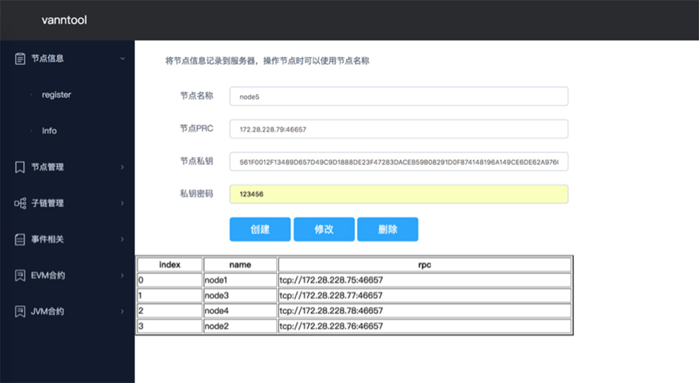

### 2.3 validator 属性变更

此功能可将非 validator 节点转为 validator 节点，获得投票权重。安链节点分为验证节点(validator节点)
和非验证节点，该功能可以调整 validator 权限。

一个新节点接入安链网络，即可同步数据。如果该节点想要提升为验证节点，或者提升为验证节点后，想要降为非验证节点，就需要使用该功能。

由于该操作安全权限较高的，仅允许从验证节点发起。

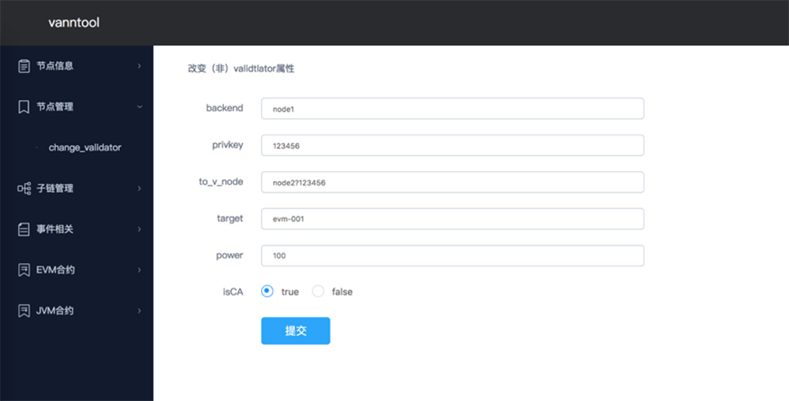

 * backend：填入validator节点的RPC监听地址（如：127.0.0.1：46657）或者已记录到服务器的节点名称（如：node1）
 * privkey：validator节点私钥，假如backend中填入的是节点名称，则私钥填已记录的节点私钥密码
 * to\_v\_node：要加入validator_set的节点公钥
 * target：接受命令的组织名称（链名称）
 * power：新validator节点的权重

### 2.4 子链管理

安链支持由主链管理若干条子链，每条子链可以执行不同的职能。目前我们支持的职能子链有 evm、ikhofi(jvm)。你可以使用以下命令，创建子链，加入子链，退出子链。每一条子链的操作方式，跟主链并没有本质的区别。

#### 2.4.1 创建子链（组织）

任何人，都可以在主链的基础上创建自己的子链，维护自己的子链的架构。如果对现有的职能子链不满意，你可以对安链进行扩展开发，创建自己的职能子链，并且在主链上维护你自己的子链。

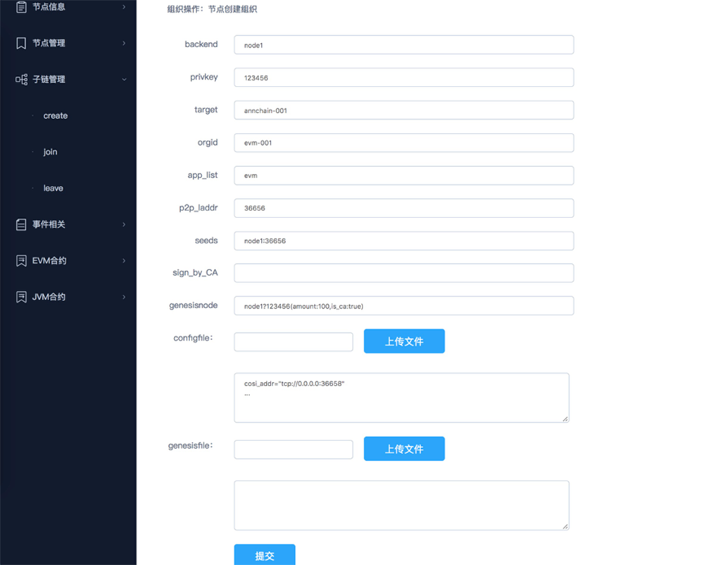

 * backend：填入节点的RPC监听地址（如：127.0.0.1：46657）或者已记录到服务器的节点名称（如：node1）
 * privkey：节点私钥，假如backend中填入的是节点名称，则私钥填已记录的节点私钥密码
 * target：接受命令的组织名称（链名称）
 * orgid：要创建的组织（子链）名称
 * app\_list：新组织加载的应用名称
 * p2p\_laddr：新组织（子链）的监听端口
 * seeds：新组织用于连接其他节点的监听地址（如：127.0.0.1：36656）或者已记录到服务器的节点名称（如：e1：36656）
 * sign\_by\_ca：CA节点对本节点公钥与新组织名称的签名结果或者节点名字与节点私钥密码（如：node1?123456）
 * genesisnode：初始成员节点
 * configfile：节点的config文件
 * genesisfile：初始成员节点的genesis文件

#### 2.4.2 加入子链（组织）

如果已经存在一条子链，并且你编译的二进制程序中，包含了该条子链的内容，你就可以遵循该子链的准入规则，加入这条子链。

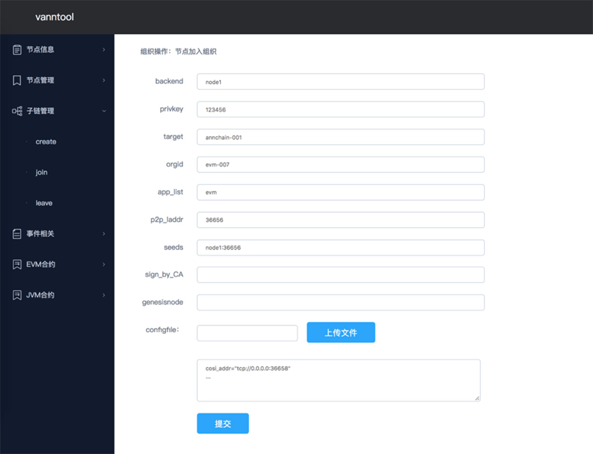

 * backend：填入节点的RPC监听地址（如：127.0.0.1：46657）或者已记录到服务器的节点名称（如：node1）
 * privkey：节点私钥，假如backend中填入的是节点名称，则私钥填已记录的节点私钥密码
 * target：接受命令的组织名称（链名称）
 * orgid：要加入的组织（子链）名称
 * app\_list：组织加载的应用名称
 * p2p\_laddr：新组织（子链）的监听端口
 * seeds：新组织用于连接其他节点的监听地址（如：127.0.0.1：36656）或者已记录到服务器的节点名称（如：node1：36656）
 * sign_by_CA：CA节点对本节点公钥与新组织名称的签名结果或者填入节点名字与节点私钥密码（如：node1?123456）
 * genesisnode：初始成员节点
 * configfile：节点的config文件
 * genesisfile：初始成员节点的genesis文件

#### 2.4.3 退出子链（组织）

如果你已经加入了某条子链，你可以选择退出它。

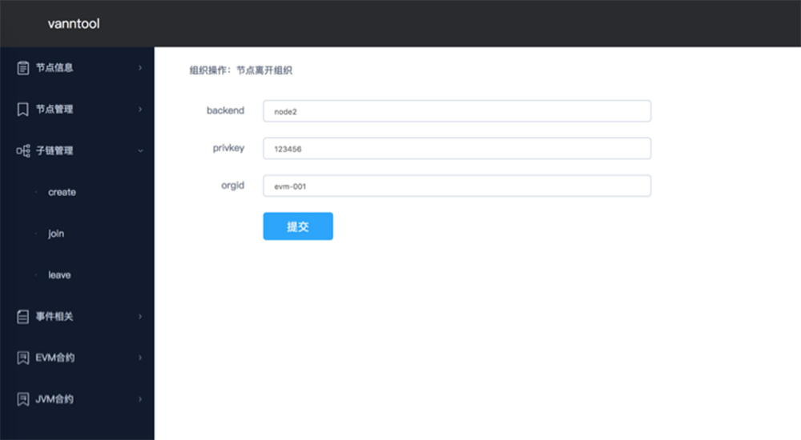

 * backend：填入节点的RPC监听地址（如：127.0.0.1：46657）或者已记录到服务器的节点名称（如：node1）
 * privkey：节点私钥，假如backend中填入的是节点名称，则私钥填已记录的节点私钥密码
 * orgid：要离开的组织（子链）名称

### 2.5 链间事件管理

安链的支持链间事件的深度开发，使用lua进行业务规则的动态处理，如果你需要在不同的职能子链之间进行事件通讯，可以使用以下功能。

#### 2.5.1 上传 code

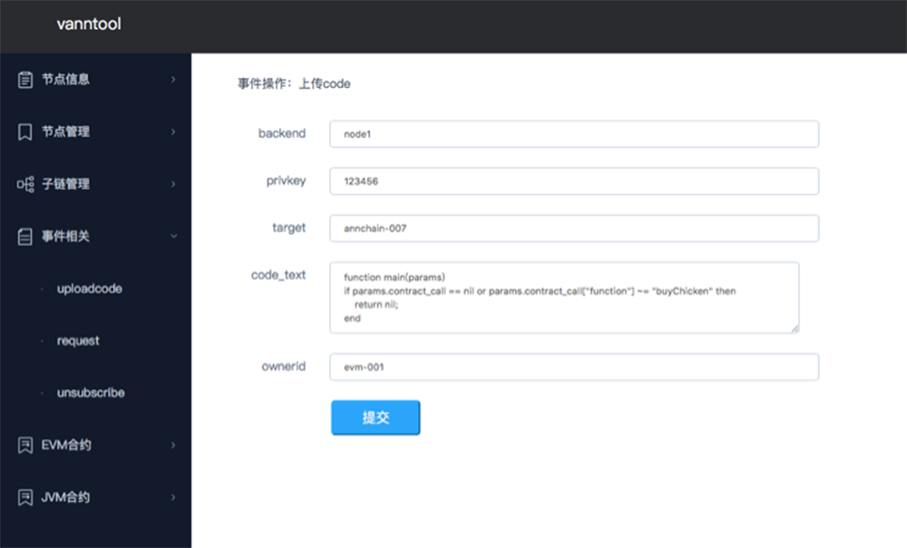

 * backend：填入节点的RPC监听地址（如：127.0.0.1：46657）或者已记录到服务器的节点名称（如：node1）
 * privkey：节点私钥，假如backend中填入的是节点名称，则私钥填已记录的节点私钥密码
 * target：接受命令的组织名称（链名称）
 * code\_text：事件通讯code，用于定义事件类型
 * ownerid：code所属的组织名称

#### 2.5.2 通讯请求

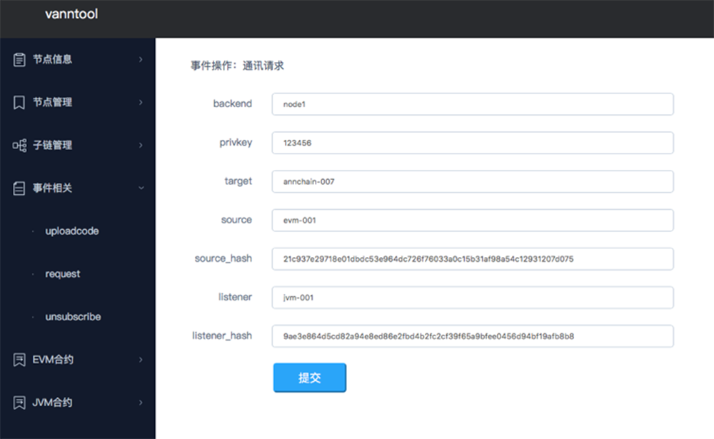

 * backend：填入节点的RPC监听地址（如：127.0.0.1：46657）或者已记录到服务器的节点名称（如：node1）
 * privkey：节点私钥，假如backend中填入的是节点名称，则私钥填已记录的节点私钥密码
 * target：接受命令的组织名称（链名称）
 * source：事件触发组织的名称
 * source\_hash：事件触发的code_hash
 * listener：监听节点的组织名称
 * listener\_hash：监听节点收到事件触发的code\_hash

#### 2.5.3 取消

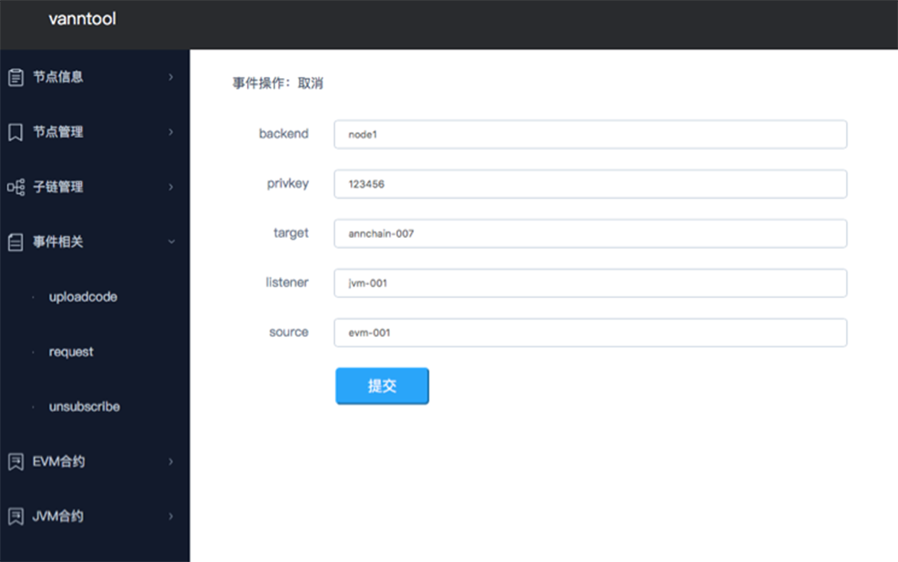

 * backend：填入节点的RPC监听地址（如：127.0.0.1：46657）或者已记录到服务器的节点名称（如：node1）
 * privkey：节点私钥，假如backend中填入的是节点名称，则私钥填已记录的节点私钥密码
 * target：接受命令的组织名称（链名称）
 * listener：监听节点的组织名称
 * source：事件触发组织的名称

### 2.6 evm 合约操作

安链的 evm 职能子链支持 evm 合约操作。

#### 2.6.1 创建evm合约

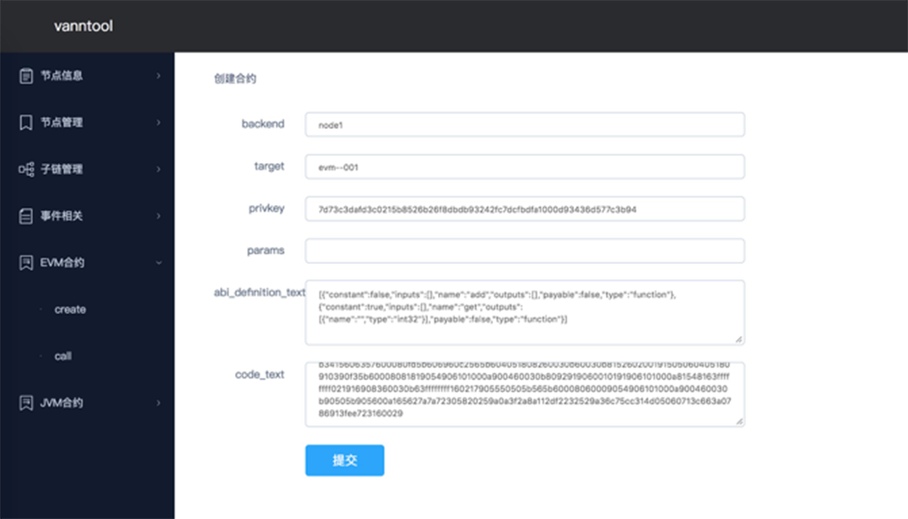

 * backend：填入节点的RPC监听地址（如：127.0.0.1：46657）或者已记录到服务器的节点名称（如：node1）
 * target：接受命令的组织名称（链名称）
 * privkey：账户私钥
 * params：调用参数
 * abi\_definition\_text：合约abi
 * code\_text：合约bytecode

#### 2.6.2 执行

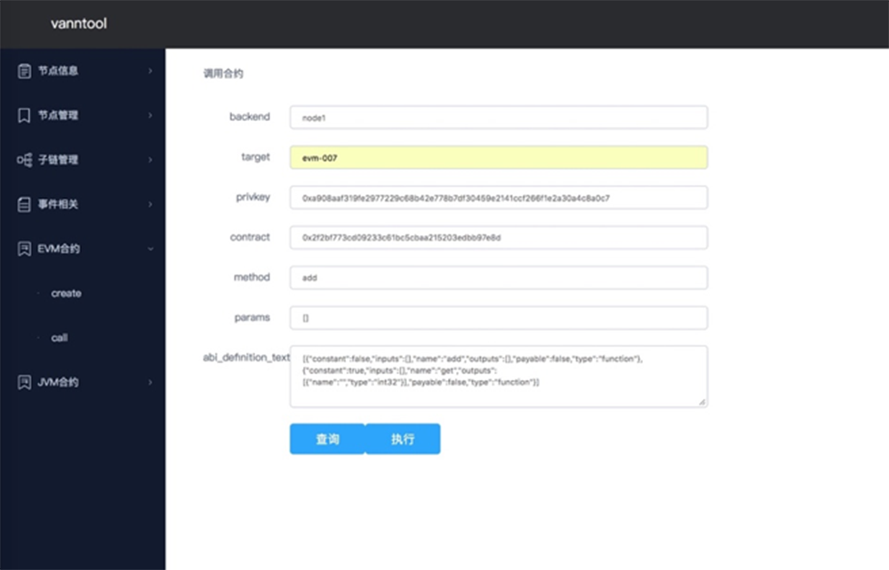

 * backend：填入节点的RPC监听地址（如：127.0.0.1：46657）或者已记录到服务器的节点名称（如：node1）
 * target：接受命令的组织名称（链名称）
 * privkey：账户私钥
 * contract：合约地址
 * method：方法名
 * params：调用参数
 * abi\_definition\_text：合约abi

#### 2.6.3 读取

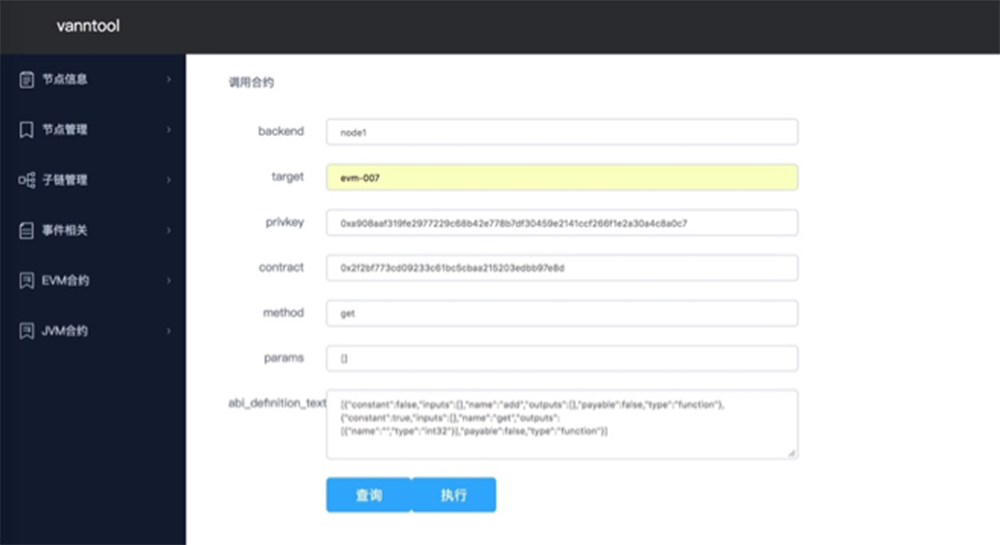

 * backend：填入节点的RPC监听地址（如：127.0.0.1：46657）或者已记录到服务器的节点名称（如：node1）
 * target：接受命令的组织名称（链名称）
 * privkey：账户私钥
 * contract：合约地址
 * method：方法名
 * params：调用参数
 * abi_definition_text：合约abi

### 2.7 ikhofi（jvm）合约操作

安链的 ikhofi（jvm）职能子链支持安链独创的 jvm 合约操作。

#### 2.7.1 创建 jvm 合约

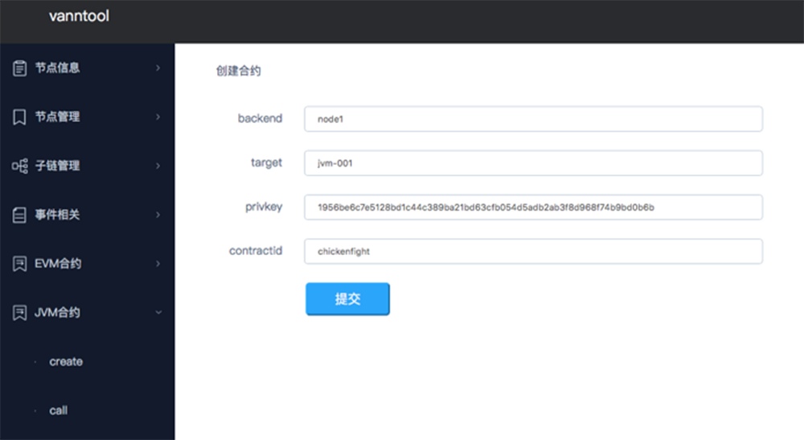

 * backend：填入节点的RPC监听地址（如：127.0.0.1：46657）或者已记录到服务器的节点名称（如：node1）
 * target：接受命令的组织名称（链名称）
 * privkey：账户私钥
 * contractid：合约名

#### 2.7.2 执行

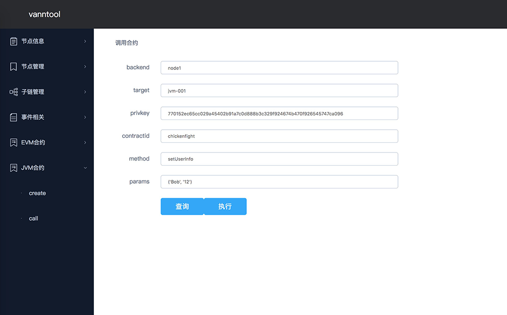

 * backend：填入节点的RPC监听地址（如：127.0.0.1：46657）或者已记录到服务器的节点名称（如：node1）
 * target：接受命令的组织名称（链名称）
 * privkey：账户私钥
 * contractid：合约名
 * method：方法名
 * params：调用参数

#### 2.7.3 读取


 * backend：填入节点的RPC监听地址（如：127.0.0.1：46657）或者已记录到服务器的节点名称（如：node1）
 * target：接受命令的组织名称（链名称）
 * privkey：账户私钥
 * contractid：合约名
 * method：方法名
 * params：调用参数
## 3 API服务
### 3.1 部署
- 首先将压缩包解压：
```shell
	tar -xzvf ann-api.tar.gz
```
- 修改conf目录下的配置文件config.json：
`ListenAddress`：api服务监听端口。`BackendCallAddress`：区块链节点rpc服务地址。`Public`：true为生产环境。`GasLimit`：solidity合约的gas限制值。`BaseChainID`：主链的名字。
```json
{
  "ListenAddress": ":8889",
  "BackendCallAddress": "tcp://0.0.0.0:46657",
  "Public":false,
  "GasLimit": 10000000,
  "BaseChainID":"hello-chain"
}
```
- 在区块链节点已经起来的前提下，启动api服务：
```shell
	nohup ann-api &
```
### 3.2 api文档
- __创建账号 /v1/accounts/create__

* Method: `POST`
* Content-Type: `application/json`
* Request Body
    * `passphrase string` (可选) - 账号密码
* Response Body
    * `isSuccess bool`  - 是否成功（`true`/`false`）
    * `result interface{}` - 返回结果，成功时account结构体，失败时为错误信息
        * `privkey string` 账号私钥
        * `address string` 账号地址

请求Body
```json
{
	"passphrase": "123456"
}
```
进行json序列化

返回Body
```json
{
	"isSuccess":true,
	"result":{
		"privkey":"7f10d921e20a2bdf6b32e020e1d337e3f9e8229b53801d3d6895a77908c3923e",
		"address":"0x50b1813f6b02e4751cc0416ab7bc658e81ecba93"
	}
}
```
privkey是账号私钥，address是账号地址，部署合约、调用合约时使用

- __部署合约 /v1/contracts/create__

* Method: `POST`
* Content-Type: `application/json`
* Request Body
    * `privkey string` (可选) - 创建人私钥
    * `chainid string (可选)` - 合约所在链ID
    * `code string` (必填) - 合约二进制代码
    * `abiDefinition string` (可选) - 合约ABI序列化字符串，合约有默认参数时必填
    * `params []interface{}` (可选) - 合约默认参数
* Response Body
    * `isSuccess bool`  - 是否成功（`true`/`false`）
    * `result interface{}` - 返回结果，成功时为合约地址，失败时为错误信息

请求Body
```json
{
	"privkey": "7f10d921e20a2bdf6b32e020e1d337e3f9e8229b53801d3d6895a77908c3923e"
	"code": "606060405234610000575b33600160006101000a81548173ffffffffffffffffffffffffffffffffffffffff021916908373ffffffffffffffffffffffffffffffffffffffff1602179055505b5b6105e48061005c6000396000f30060606040526000357c0100000000000000000000000000000000000000000000000000000000900463ffffffff168063522afaec1461006a57806357344e6f146100a65780638da5cb5b146100ed578063beabacc81461013c578063f27ac4d914610197575b610000565b34610000576100a4600480803573ffffffffffffffffffffffffffffffffffffffff169060200190919080359060200190919050506101d3565b005b34610000576100d7600480803573ffffffffffffffffffffffffffffffffffffffff169060200190919050506102bc565b6040518082815260200191505060405180910390f35b34610000576100fa610306565b604051808273ffffffffffffffffffffffffffffffffffffffff1673ffffffffffffffffffffffffffffffffffffffff16815260200191505060405180910390f35b3461000057610195600480803573ffffffffffffffffffffffffffffffffffffffff1690602001909190803573ffffffffffffffffffffffffffffffffffffffff1690602001909190803590602001909190505061032c565b005b34610000576101d1600480803573ffffffffffffffffffffffffffffffffffffffff16906020019091908035906020019091905050610486565b005b600160009054906101000a900473ffffffffffffffffffffffffffffffffffffffff1673ffffffffffffffffffffffffffffffffffffffff163373ffffffffffffffffffffffffffffffffffffffff1614151561022f57610000565b600073ffffffffffffffffffffffffffffffffffffffff168273ffffffffffffffffffffffffffffffffffffffff16141561026957610000565b80600060008473ffffffffffffffffffffffffffffffffffffffff1673ffffffffffffffffffffffffffffffffffffffff168152602001908152602001600020600082825401925050819055505b5b5050565b6000600060008373ffffffffffffffffffffffffffffffffffffffff1673ffffffffffffffffffffffffffffffffffffffff1681526020019081526020016000205490505b919050565b600160009054906101000a900473ffffffffffffffffffffffffffffffffffffffff1681565b600073ffffffffffffffffffffffffffffffffffffffff168373ffffffffffffffffffffffffffffffffffffffff1614806103935750600073ffffffffffffffffffffffffffffffffffffffff168273ffffffffffffffffffffffffffffffffffffffff16145b806103dc575080600060008573ffffffffffffffffffffffffffffffffffffffff1673ffffffffffffffffffffffffffffffffffffffff16815260200190815260200160002054105b156103e657610000565b80600060008573ffffffffffffffffffffffffffffffffffffffff1673ffffffffffffffffffffffffffffffffffffffff1681526020019081526020016000206000828254039250508190555080600060008473ffffffffffffffffffffffffffffffffffffffff1673ffffffffffffffffffffffffffffffffffffffff168152602001908152602001600020600082825401925050819055505b505050565b600160009054906101000a900473ffffffffffffffffffffffffffffffffffffffff1673ffffffffffffffffffffffffffffffffffffffff163373ffffffffffffffffffffffffffffffffffffffff161415156104e257610000565b600073ffffffffffffffffffffffffffffffffffffffff168273ffffffffffffffffffffffffffffffffffffffff16148061055b575080600060008473ffffffffffffffffffffffffffffffffffffffff1673ffffffffffffffffffffffffffffffffffffffff16815260200190815260200160002054105b1561056557610000565b80600060008473ffffffffffffffffffffffffffffffffffffffff1673ffffffffffffffffffffffffffffffffffffffff168152602001908152602001600020600082825403925050819055505b5b50505600a165627a7a7230582054c82c348ab03c11de0d95121714d87f5a9fac42be59174170975e4c584582e20029"
}
```

返回Body
```json
{
	"isSuccess": true,
	"result": {
		"contract": "0x74b00eb94d263ba2812e3eacb61e51cd771db283",
		"tx": "0xe736921e330f250e86e5be3008ade1a584356dbd709c376ecf64de97aa232c64"
	}
}
```
result的值即为合约地址

- __合约调用(写) /v1/contracts/call__

* Method: `POST`
* Content-Type: `application/json`
* Request Body
    * `privkey string` (可选) - 调用人私钥
    * `chainid string` (可选) - 合约所在链ID
    * `contract string` (必填) - 合约地址
    * `abiDefinition string` (必填) - 合约ABI序列化字符串
    * `method string` (必填) 调用方法
    * `params []interface{}` (必填) - 调用参数
* Response Body
    * `isSuccess bool`  - 是否成功（`true`/`false`）
    * `result interface{}` - 返回结果，成功时为交易Hash值，失败时为错误信息
    * `nonce uint64` - (可选)账号nonce,防止批量操作api查询不及时

请求Body
```json
{
	"contract": "0xca6d1583000710335dcb9e417c79170f8f7c9b22",
	"privkey": "7f10d921e20a2bdf6b32e020e1d337e3f9e8229b53801d3d6895a77908c3923e"
	"method": "increase",
	"params":[
		"0x4f33741393234b419b66621d1276031d474b3612", 100
	],
	"abiDefinition": "[{\"constant\":false,\"inputs\":[{\"name\":\"_to\",\"type\":\"address\"},{\"name\":\"_credits\",\"type\":\"uint256\"}],\"name\":\"increase\",\"outputs\":[],\"payable\":false,\"type\":\"function\"},{\"constant\":true,\"inputs\":[{\"name\":\"_who\",\"type\":\"address\"}],\"name\":\"getCredit\",\"outputs\":[{\"name\":\"\",\"type\":\"uint256\"}],\"payable\":false,\"type\":\"function\"},{\"constant\":true,\"inputs\":[],\"name\":\"owner\",\"outputs\":[{\"name\":\"\",\"type\":\"address\"}],\"payable\":false,\"type\":\"function\"},{\"constant\":false,\"inputs\":[{\"name\":\"_from\",\"type\":\"address\"},{\"name\":\"_to\",\"type\":\"address\"},{\"name\":\"_credits\",\"type\":\"uint256\"}],\"name\":\"transfer\",\"outputs\":[],\"payable\":false,\"type\":\"function\"},{\"constant\":false,\"inputs\":[{\"name\":\"_to\",\"type\":\"address\"},{\"name\":\"_credits\",\"type\":\"uint256\"}],\"name\":\"decrease\",\"outputs\":[],\"payable\":false,\"type\":\"function\"},{\"inputs\":[],\"payable\":false,\"type\":\"constructor\"}]"
}
```
返回Body
```json
{
	"isSuccess":true,
	"result":"0x24bc49f8e05e16a17f68cb732db13ed38255263a593b88f9a378a208bf5e6c8f"
}
```

- __合约调用(读) /v1/contracts/read__

* Method: `POST`
* Content-Type: `application/json`
* Request Body
    * `privkey string` (可选) - 调用人私钥，注意这里的可选是指privkey
    * `chainid string` (可选) - 合约所在链ID
    * `contract string` (必填) - 合约地址
    * `abiDefinition string` (必填) - 合约ABI序列化字符串
    * `method string` (必填) 调用方法
    * `params []interface{}` (必填) - 调用参数
* Response Body
    * `isSuccess bool`  - 是否成功（`true`/`false`）
    * `result interface{}` - 返回结果，成功时为方法返回值，失败时为错误信息
    * `nonce uint64` - (可选)账号nonce,防止批量操作api查询不及时

请求Body
```json
{
	"contract": "0xca6d1583000710335dcb9e417c79170f8f7c9b22",
	"privkey": "7f10d921e20a2bdf6b32e020e1d337e3f9e8229b53801d3d6895a77908c3923e"
	"method": "getCredit",
	"params":[
		"0x4f33741393234b419b66621d1276031d474b3612"
	],
	"abiDefinition": "[{\"constant\":false,\"inputs\":[{\"name\":\"_to\",\"type\":\"address\"},{\"name\":\"_credits\",\"type\":\"uint256\"}],\"name\":\"increase\",\"outputs\":[],\"payable\":false,\"type\":\"function\"},{\"constant\":true,\"inputs\":[{\"name\":\"_who\",\"type\":\"address\"}],\"name\":\"getCredit\",\"outputs\":[{\"name\":\"\",\"type\":\"uint256\"}],\"payable\":false,\"type\":\"function\"},{\"constant\":true,\"inputs\":[],\"name\":\"owner\",\"outputs\":[{\"name\":\"\",\"type\":\"address\"}],\"payable\":false,\"type\":\"function\"},{\"constant\":false,\"inputs\":[{\"name\":\"_from\",\"type\":\"address\"},{\"name\":\"_to\",\"type\":\"address\"},{\"name\":\"_credits\",\"type\":\"uint256\"}],\"name\":\"transfer\",\"outputs\":[],\"payable\":false,\"type\":\"function\"},{\"constant\":false,\"inputs\":[{\"name\":\"_to\",\"type\":\"address\"},{\"name\":\"_credits\",\"type\":\"uint256\"}],\"name\":\"decrease\",\"outputs\":[],\"payable\":false,\"type\":\"function\"},{\"inputs\":[],\"payable\":false,\"type\":\"constructor\"}]"
}
```
返回Body
```json
{
	"isSuccess":true,
	"result":400
}
```
- __查询账余额 /v1/balance/:address__

* Method: `GET`
* :address 要查询的账户地址
* Response Body
    * `isSuccess bool`  - 是否成功（`true`/`false`）
    * `result interface{}` - 返回结果，成功时account结构体，失败时为错误信息
        * `result string` 余额数目

请求URL:
```
/v1/balance/0x7752b42608a0f1943c19fc5802cb027e60b4c911
```
返回Body
```json
{
	"isSuccess": true,
	"result": "100000000000000000"
}
```

- __查询nonce /v1/nonce/:address__

* Method: `GET`
* :address 要查询的账户地址
* Response Body
    * `isSuccess bool`  - 是否成功（`true`/`false`）
    * `result interface{}` - 返回结果，成功时account结构体，失败时为错误信息
        * `result string` nonce数目

请求URL:
```
v1/nonce/0x7752b42608a0f1943c19fc5802cb027e60b4c911
```
返回Body
```json
{
	"isSuccess": true,
	"result": "0"
}
```

- __获取收据 /v1/receipt/:txhash__

* Method: `GET`
* :txhash 交易的哈希值
* Response Body
    * `isSuccess bool`  - 是否成功（`true`/`false`）
    * `result map[string]interface{}` - 返回结果，成功时receipt结构体，失败时为错误信息
        * `ContractAddress string` 合约地址
	* `TxHash` 交易哈希值

请求URL:
```
v1/receipt/0x022ef2416274b079ae84d8243e48b337ea50fd6f378f9c832ac0b003f9040e23
```
返回Body
```json
{
	"isSuccess": true,
	"result": {
		"PostState": "e+n2OXOpSc9f0WF3fRPaf1a0U1iypj7PlALAebuyO0Q=",
		"CumulativeGasUsed": 2700976,
		"Bloom": "0x00000000000000000000000000000000000000000000000000000000000000000000000000000000000000000000000000000000000000000000000000000000000000000000000000000000000000000000000000000000000000000000000000000000000000000000000000000000000000000000000000000000000000000000000000000000000000000000000000000000000000000000000000000000000000000000000000000000000000000000000000000000000000000000000000000000000000000000000000000000000000000000000000000000000000000000000000000000000000000000000000000000000000000000000000000000",
		"Logs": [],
		"TxHash": "0x022ef2416274b079ae84d8243e48b337ea50fd6f378f9c832ac0b003f9040e23",
		"ContractAddress": "0xf7bf7cedb2c6edeb9fe4871287e283053fecf45e",
		"GasUsed": 2700976
	}
}
```

- __调用合约直到提交再返回 /v1/contract/commitcall__

POST用法和参数 与 /v1/contract/call 相同
返回Body,返回交易hash则说明交易调用成功
```json
{
	"isSuccess":true,
	"result":"0x24bc49f8e05e16a17f68cb732db13ed38255263a593b88f9a378a208bf5e6c8f"
}
```
## 4 区块链浏览器
区块链浏览器服务于安链，提供基本的搜索功能，允许用户查找和确认在安链上发生的交易。浏览器的任务是使得链上的操作更加透明，可以通过很便捷的方式搜索每一个块信息和每一个交易信息。此外浏览器还提供API服务供使用者查询链上信息。
### 4.1 部署
- 浏览器可以选择使用mongodb或者sqlite3，如果使用mongodb，则需先安装mongodb。
- 解压`browser-all.zip`：
```shell
unzip  browser-all.zip
```
- 修改配置文件`conf/app.conf`：
`appname`是服务名称。`httpport`是服务端口。`runmode`是程序运行模式(`dev`/`prod`)。`mogo_addr`是mongo服务的地址，如果不填，则默认使用sqlite3。`api_addr`是区块链节点对外的api服务地址。`chain_id`是浏览器展示的区块链链名称。
```toml
appname = hubble
httpport = 9090
runmode ="dev"

api_addr = "127.0.0.1:46657" 
chain_id = "chorus"
                                   
mogo_db = "hubble"
sync_job = 1
```
- 启动服务：
```shell
	nohup block-browser &
```
### 4.2 当前链的高度和交易数量
右上方输入框可以根据交易hash，账户公钥，和块高度查看相关详细数据：

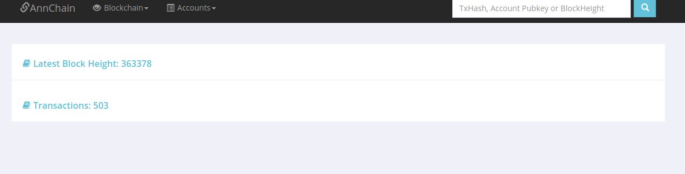
### 4.3 详细数据
#### 4.3.1 块数据
首页展示最近25个块数据，从左至右内容依次为：块哈希、块高度、提块节点和验证节点的哈希、包含的交易数目、出块时间。

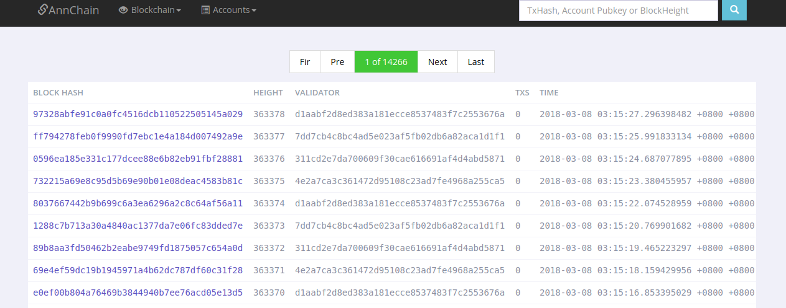

点开块哈希的链接，可以看到该块的详细数据：


#### 4.3.2 交易数据
首页展示最近25个交易数据，从左至右内容依次为：交易所在的块哈希、交易哈希、交易发起者公钥、交易发起者nonce：

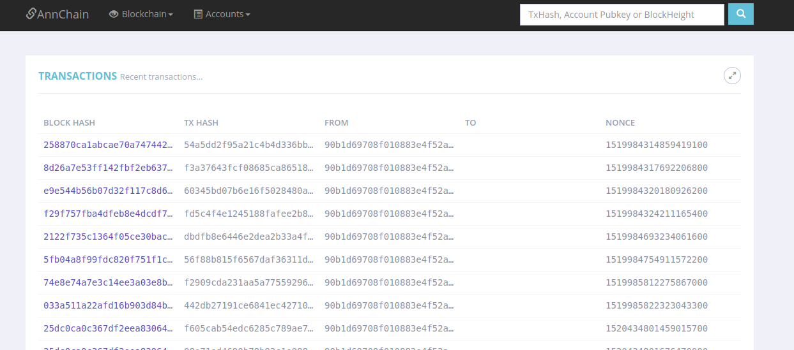

点开交易哈希的连接，可以看到交易在该块的详细数据：

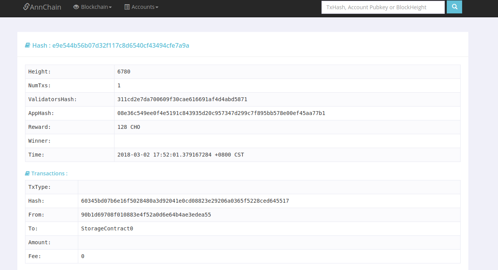
#FAQ


